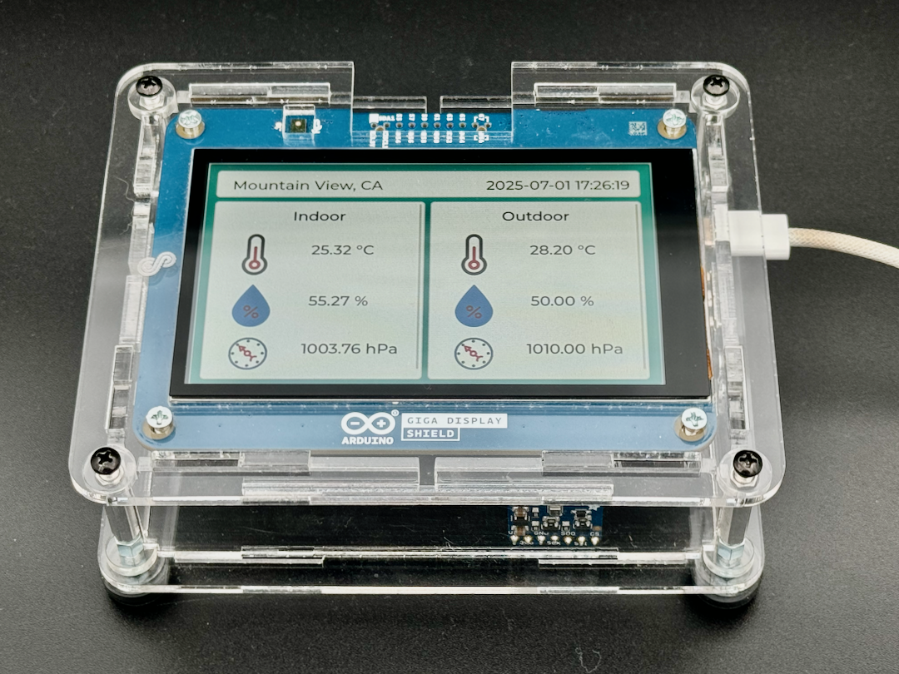
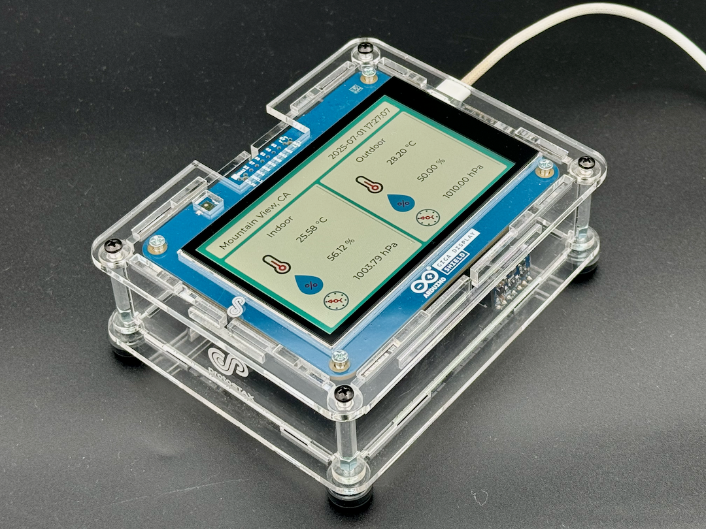
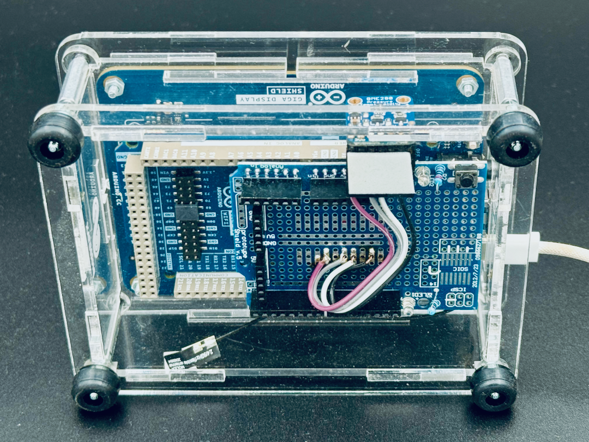
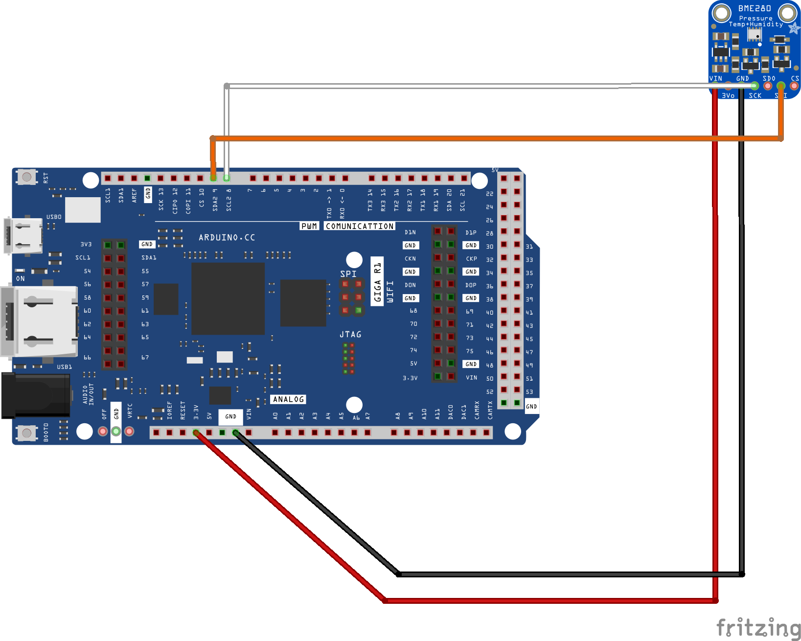

# ProtoStaxAG_WeatherStation
Weather station with Arduino Giga Display and BME280 

Built with:
* [ProtoStaxAG Enclosure for Arduino Giga Display](https://www.protostax.com/products/protostax-ag-enclosure-for-arduino-giga-display)
* Arduino Giga Display Shield
* Arduino Giga R1 WIFI
* Adafruit BME280
* Arduino Prototyping Shield
* Jumper wires





For further instructions, see [Weather Station with Indoor & Outdoor data](https://www.hackster.io/sridhar-rajagopal/weather-station-with-indoor-outdoor-data-2a7b44)

## Prerequisites

Hook up the Adafruit BME280 to your Arduino Giga R1. You can use a prototyping shield to simplify connections. 



Connect the antenna to the Arduino Giga R1 WiFi if you haven't already
Connect the Arduino Giga Display to the Arduino Giga R1 WiFi

Put everything in the ProtoStaxAG Enclosure for Arduino Giga Display for a portable Weather Station

## Installing

Get the source code
```
git clone https://github.com/protostax/ProtoStaxAG_WeatherStation.git
```

Install the dependencies: 

Arduino Mbed OS Giga Boards - version 4.3.1

The demos use the following libraries:

* LVGL (verion 9.3.0)
* Arduino_BMI270_BMM150 (version 1.2.1)
* Arduino_GigaDisplay (version 1.0.2)
* Arduino_GigaDisplayTouch (version 1.0.1)
* Adafruit BME280 Library (version 2.3.0)
  * Adafruit BusIO (version 1.17.1) (dependencies for Adafruit BME280 Library)
  * Adafruit Unified Sensor (version 1.1.15) (dependencies for Adafruit BME280 Library)
* ArduinoJson (version 7.4.2)

You can use the Arduino Library Manager to install the necessary libraries if not already installed
Arduino IDE->Sketch->Include LIbrary->Manage Libraries 

If you're building using the arduino-cli, you can do the following:

```
cd ProtoStaxAG_WeatherStation
arduino-cli compile --profile arduinogigadisplay
```

which will install the necessary dependencies for the build. 

This demo uses Open Weather Map to get the outdoor temperature, humidity and pressure. You will need to get an API key calling the service. 

Create an arduino_secrets.h and populate it with your WiFi SSID, password, and Open Weather Map API Key:

Define the following in your arduino_secrets.h file (create this file in this folder):
```
   #define SECRET_SSID "YOUR_SSID"
   #define SECRET_PASS "YOUR_WIFI_PASSWORD"
   #define SECRET_OWM_API_KEY "YOUR_OWM_API_KEY"
```
You will also need to update the lv_conf_9.h to enable LV_FONT_MONTSERRAT_28 (font size 28):

if you're using arduino-cli, update:
Library/Arduino15/internal/arduino_mbed_giga_4.3.1_30b02db2e5f51793/libraries/Arduino_H7_Video/src/lv_conf_9.h 

If you're using the IDE to build, locate the lv_conf_9.h in the
Library/Arduino15/packages/arduino/hardware/mbed_giga/4.3.1/libraries/Arduino_H7_Video/src/lv_conf_9.h 

In the file, change 
#define LV_FONT_MONTSERRAT_28 0 
to 
#define LV_FONT_MONTSERRAT_28 1

and build again. We use a bigger font size, and by default only font size _14 is enabled. 

Also make sure to update the latitude, longitude and location fields in ProtoStaxAG_WeatherStation.ino to your location, 
and also update the timezone field to your appropriate one. 

You can update the icons used to your own ones. You can use the [LVGL image converter](https://lvgl.io/tools/imageconverter) to convert your image to a c file that you can include here. 
The temperature, humidity and pressure icon c files were created using that tool. 

## Usage

The sketch starts up, creates the GUI, and periodically queries the BME280 sensor for the indoor temperature, humidity and pressure. 
It also connects to WiFi and then to the Open Weather Map service to get the outdoor temperature, humidity and pressure for the location. 
It connects to NTP to get and set the date and time in the RTC of the board. 

The outdoor data is updated every minute. The indoor data is updated every second, and we also retrieve and update the current time when we do so. 

## License

Written by Sridhar Rajagopal for ProtoStax. BSD license, all text above must be included in any redistribution

A lot of time and effort has gone into providing this and other code. Please support ProtoStax by purchasing products from us!
